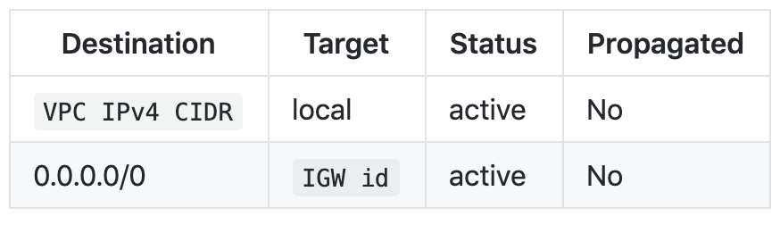
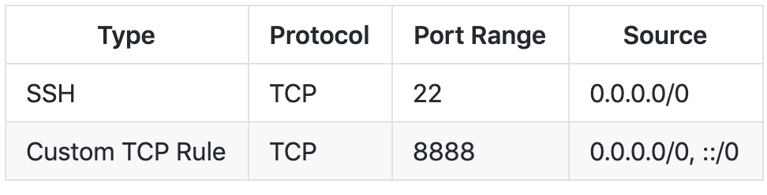
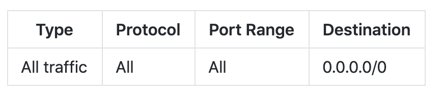
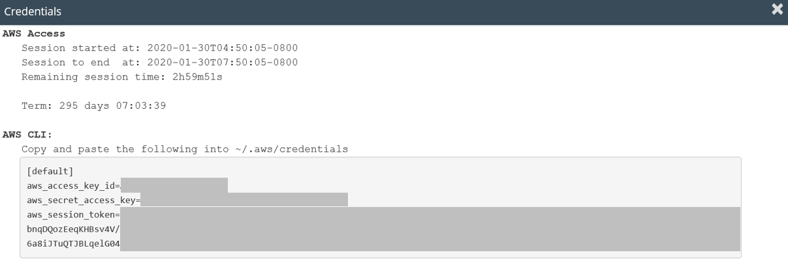
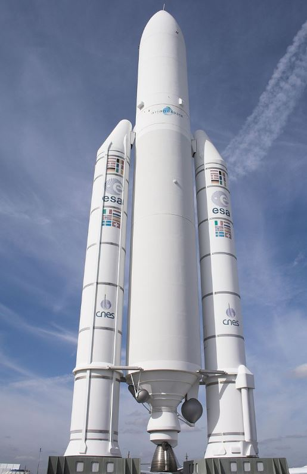
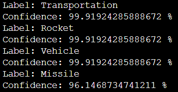

# AWS -object rekognition

**Objective**: Detect the object using an AWS Rekognition API in a setted distant machine

## Step1-set up and launch the instance

### Set up the configuration

* Create a VPC with /16 IPv4 CIDR block;
* Create 1 public subnet inked to the VPC with /24 IPv4 CIDR block within one AZ；
* Create 1 Internet Gateway associated with the public subnet；
* 1 Route table;



1 Ubuntu instances (Back-end_server);
* Create an instance: Back-end_server (public) with type Ubuntu Server 18.04 LTS (HVM) (ami-04b9e92b5572fa0d1), type t2.micro, enable Auto-assign Public IP to avoid EIP creation (no flexibility needed here) and configure storage to 16 GB (it could be more or less depending on your need).


**Inbound rule**:



**Outbound rule**:



### launch the instance
Same as in AWS_Jumpbox repository.

## Step2 - Configuration of the backend server
### 1.Install Jupyter & open file in virtual machine
* Check if python3 is installed
```
python3

```
* Install pip
```
sudo apt-get update -y
sudo apt-get install python3-pip
```
* Install Jupyter
```
sudo pip3 install jupyter
```
* Open Jupyter Notebook
```
jupyter notebook --ip=0.0.0.0 --no-browser
```

### 2.Use pew to link to Jupyter

* Install pew and create a new pew environment
```
pip3 install pew

```
```
pew new brieuc
```
* Exit and go back to the pew environment
```
exit
```
```
pew workon brieuc
```
* Check current virtual environment
```
pew ls
```
* Install Pandas and then list everything and store them.
```
pip3 install pandas
```
```
pip3 freeze > myEnv.tx
```
* Link to Jupyter
```
pip3 install ipykernel

python3 -m ipykernel install --user --name=brieuc
```

## Step3 - Clone Github repository

```
sudo apt-get install git

git clone https://github.com/bdague324/AWS-rekognition.git

```
### Find your credential keys in Vocareum:


Change the AWS credentials (access key id and secret access key) and pic_name in the reko.py code

## Step4 - Test picture on Rekognition API (reko.py) & Result .

### Tested picture



### Results of the detection in percentage


